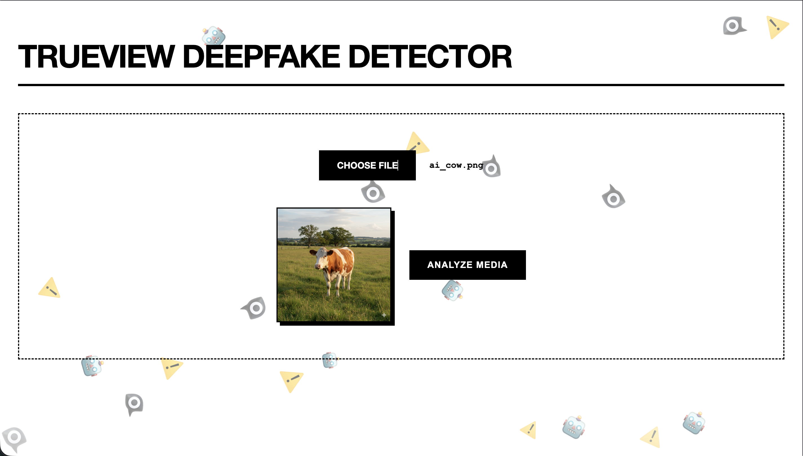
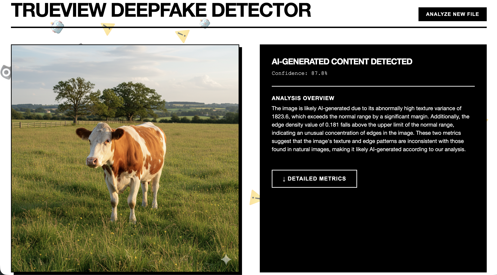
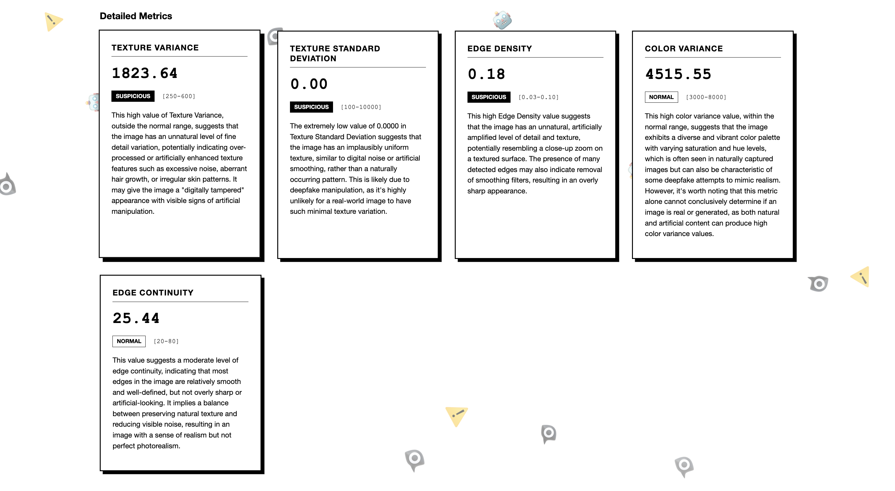
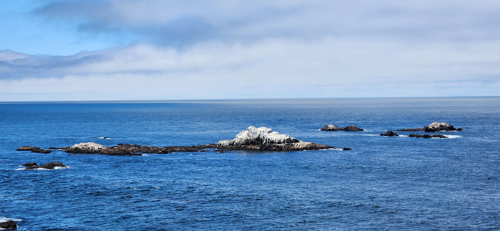

# TrueView Deepfake Detector

TrueView is a high-performance, deepfake detection tool that combines Computer Vision metrics with LLM-based explainability to provide transparent verdicts on media authenticity.

While the primary verdict is sourced from the **AI or NOT API**, TrueView's main goal is **education**. By bridging the gap between technical forensic metrics and human-readable explanations, TrueView empowers users to understand not just *if* an image or video is fake, but *why*, teaching them to identify AI artifacts themselves through detailed metric analysis.

### System Design for the project : [Whiteboard Design](https://miro.com/app/board/uXjVJ_YfxHM=/?share_link_id=273812755751)

## Project Overview

In an era of increasingly sophisticated generative AI, traditional detection methods often fall short or lack transparency. TrueView addresses this by employing a hybrid approach:

1.  **Verdict Retrieval**: Uses the **AI or NOT API** to provide an initial high-confidence classification.
2.  **Computer Vision Analysis**: Extracts raw forensic data such as edge consistency, texture variance, and motion artifacts using OpenCV.
3.  **LLM Interpretation**: Utilizes a local Large Language Model (via Ollama) to analyze these metrics and generate context-aware explanations.
4.  **Privacy-Centric Design**: All processing happens locally on your machine, ensuring data privacy and security.

### Key Capabilities
*   **Deepfake Detection**: Identifies signs of AI generation in both images and videos.
*   **Granular Metrics**: Analyzes specific artifacts like "unnatural skin smoothing" or "flickering edges".
*   **Natural Language Reports**: Converts complex numerical data into easy-to-understand summaries.

### Performance Benchmarks

| Operation | Previous Time | Current Time | Improvement |
| :--- | :---: | :---: | :---: |
| **Upload to First Result** | **~13s** | **~5s** |  Instant Feedback |
| **Detailed Analysis** | ~53s | **~23s** | ~57% Faster |

## Recent Updates

### Performance Improvements
The backend architecture has been refactored for speed and responsiveness:
 
- **Asynchronous Core:** Built on FastAPI with fully async endpoints to handle concurrent requests.
- **Parallel Processing:** Metric explanations are generated in parallel using `asyncio.gather`, reducing the total analysis time from linear (sum of all parts) to the duration of the single longest task.
- **Non-Blocking Execution:** Heavy Computer Vision tasks (`MediaAnalyzer`) are offloaded to thread executors, ensuring the server remains responsive during file uploads.






## 🛠️ Setup & Installation

1. **Clone the repository**
   ```bash
   git clone https://github.com/yourusername/TrueView.git
   cd TrueView
   ```

2. **Set up the Backend**
   ```bash
   cd backend
   python -m venv venv
   source venv/bin/activate  # On Windows: venv\Scripts\activate
   pip install -r requirements.txt
   ```

3. **Run the Server**
   ```bash
   # From the root directory
   uvicorn backend.save_file:app --reload
   ```

4. **Run the Frontend**
   ```bash
   cd frontend
   python -m http.server 8080
   # Open http://localhost:8080 in your browser
   ```

## 🧪 Test Images


### Real Media


*Description: Authentic footage with natural noise and consistent lighting.*

### AI-Generated Media
<!-- Add path to a deepfake/AI image below -->

*Description: AI-generated content showing characteristic texture smoothing and edge inconsistencies.*

## 🏗️ Architecture
- **Backend:** Python, FastAPI, OpenCV
- **AI/LLM:** Local LLM integration (Ollama) or Gemini API for explainability
- **Frontend:** HTML5, CSS3, Vanilla JavaScript (No frameworks)
